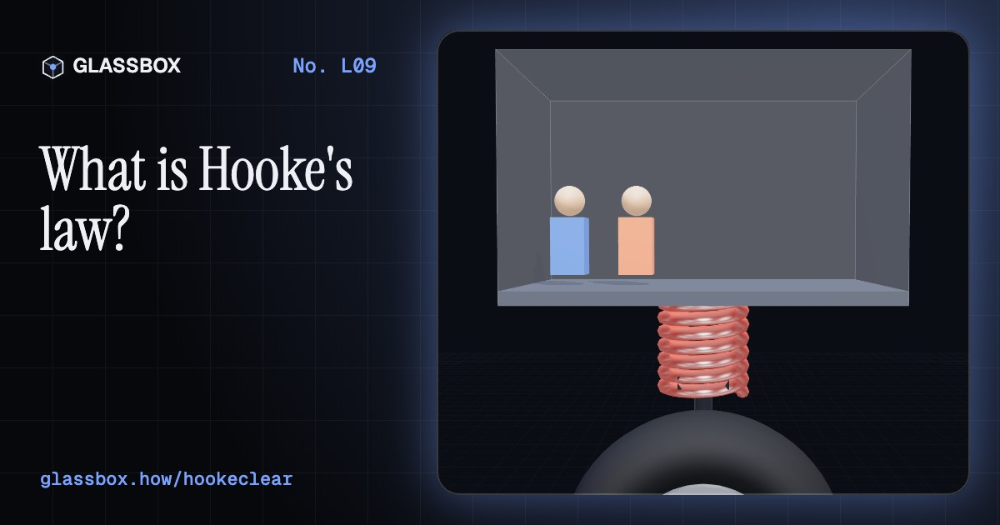
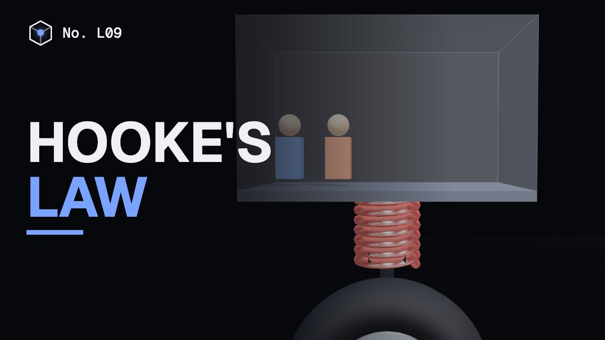
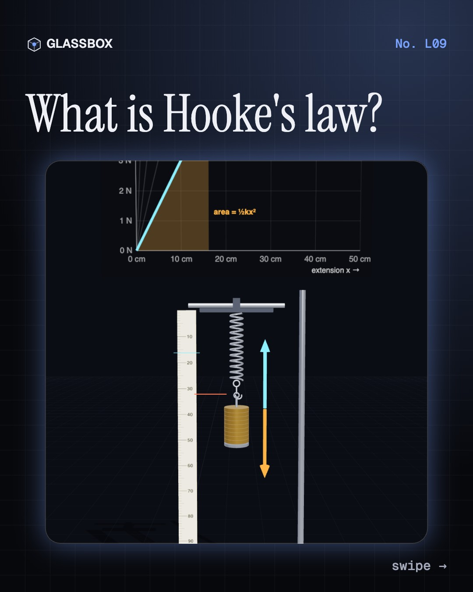
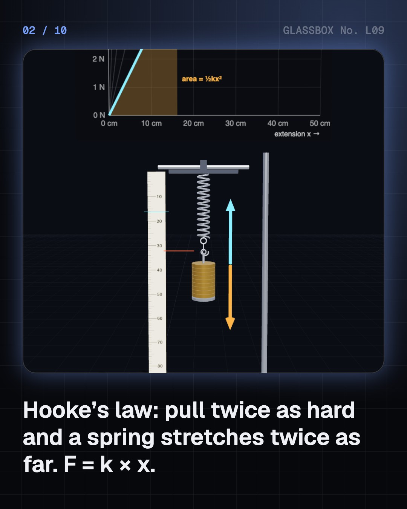
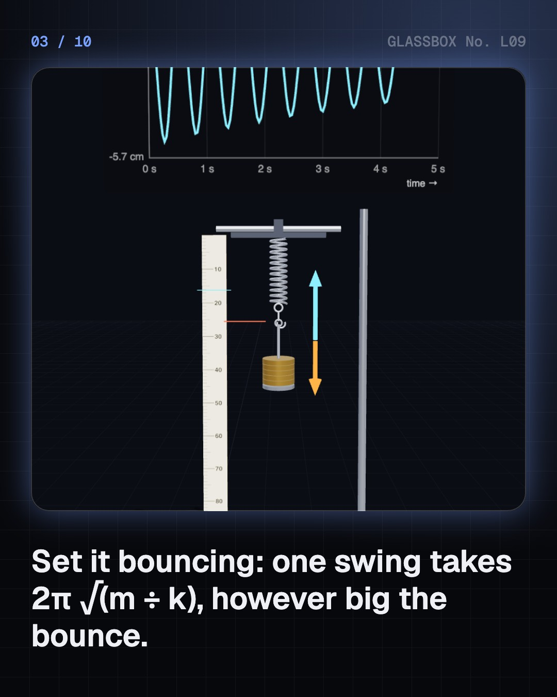
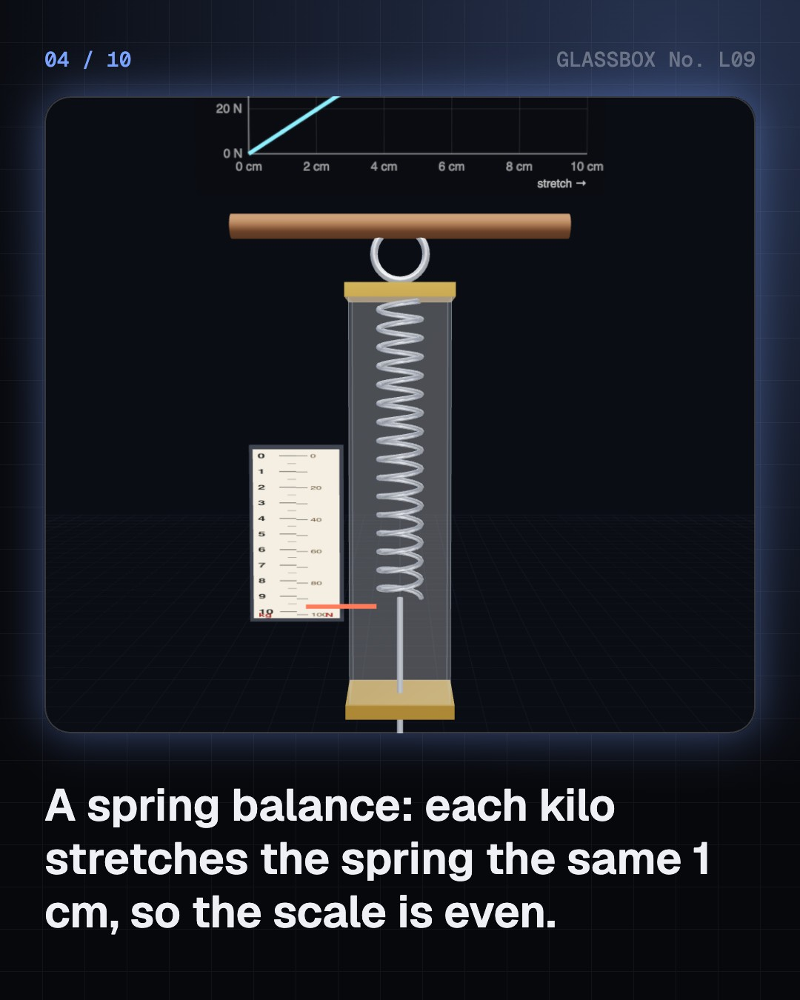

<!-- glassbox:start -->
<!-- Generated from glassbox.json by the Glassbox hub (npm run readme -- hookeclear). Edit glassbox.json, not this block. -->
<p align="center"><a href="https://glassbox-production-fd52.up.railway.app/e/hookeclear/"></a></p>

<h1 align="center">Hooke's law</h1>

<p align="center"><b>What is Hooke's law?</b><br>Pull twice as hard and a spring stretches twice as far. That one line from 1676 weighs your onions, clicks your pen, carries your car and tunes your guitar. Hang masses on 3D springs, bounce a car over a speed breaker, jump off a bridge on a bungee, and stretch steel until it snaps.</p>

<p align="center"><a href="https://glassbox-production-fd52.up.railway.app/hookeclear/"><b>▶ Play with it</b></a> &nbsp;·&nbsp; <a href="https://glassbox-production-fd52.up.railway.app/e/hookeclear/">Read the 60-second explainer</a> &nbsp;·&nbsp; <a href="https://glassbox-production-fd52.up.railway.app/hookeclear/glassbox/reel.mp4">Watch the 40-second video</a></p>

<p align="center">
  <a href="https://glassbox-production-fd52.up.railway.app/e/hookeclear/"></a>
  <a href="https://glassbox-production-fd52.up.railway.app/e/hookeclear/"></a>
  <a href="LICENSE"></a>
  <a href="LICENSE-CONTENT.md"></a>
  <a href="#privacy"></a>
</p>

## In 60 seconds

1. **Twice the pull, twice the stretch.** A spring stretches in proportion to the force on it: F = k × x. The spring constant k is its stiffness in newtons per metre. Plot force against stretch and you get a straight line whose slope is k. Springs end to end get softer; side by side, stiffer.
2. **Springs store energy and keep time.** A stretched spring stores ½ k x², the area under the line. Let a mass bounce on it and each swing takes 2π √(m ÷ k), however big the bounce. That steady beat is why springs regulate watches.
3. **Weighing and clicking.** Because stretch is proportional to load, a spring balance can have evenly spaced marks. It measures force, so on the Moon 6 kg of onions reads 1 kg. A click pen's spring pushes back with about 2 N.
4. **Riding on springs.** A car's corner spring squeezes about 10 cm under its share of the weight and would bounce about 1.5 times a second, so a damper turns the bounce into heat. A bungee cord stores all the energy of a fall as ½ k x².
5. **Past the elastic limit.** Steel obeys Hooke's law only to about 0.1 % stretch. Beyond its yield point it stays stretched, then necks and breaks. Rubber never follows a straight line. And for the same force, a softer spring stores more energy, not less.

## Words worth knowing

| Term | Meaning |
|---|---|
| **Hooke's law** | The force on a spring is proportional to its extension: F = k × x. |
| **Spring constant** | A spring's stiffness, k, in newtons per metre: the force needed for each metre of stretch. |
| **Extension** | How much longer or shorter a spring is than its natural length. |
| **Elastic energy** | Energy stored in a stretched spring: ½ k x², the area under the force–extension line. |
| **Period** | The time for one bounce of a mass on a spring: T = 2π √(m ÷ k). |
| **Young's modulus** | A material's own stiffness: stress ÷ strain. About 200 GPa for steel. |
| **Elastic limit** | The largest stretch or stress after which a material still springs fully back. |
| **Plastic deformation** | A permanent change of shape once the elastic limit is passed. |

## A short history

**From twisted-sinew catapults to silicon springs in your phone, by way of a 1676 anagram.**

- **1675** · A spiral spring keeps time (Christiaan Huygens, with the clockmaker Isaac Thuret, Paris, France)
- **1676** · The law as a puzzle (Robert Hooke, London, England)
- **1678** · 'As the extension, so the force' (Robert Hooke, London, England)
- **1807** · Young's modulus (Thomas Young, London, England)
- **1934** · Coil springs for every wheel (General Motors, Detroit, United States)
- **1979** · The first modern bungee jump (David Kirke and Simon Keeling, Oxford University Dangerous Sports Club, Clifton Suspension Bridge, Bristol, England)
- **1991** · Springs on a chip (Analog Devices, Massachusetts, United States)

The full story, with 20 moments, charts, people and 22 sources: [glassbox.how/e/hookeclear/history](https://glassbox-production-fd52.up.railway.app/e/hookeclear/history/). The data lives in [`history.json`](history.json).

## Video and slides

Made with the Glassbox studio from this box's storyboard (`window.glassbox.director`). Free to reuse under CC BY 4.0.

<a href="https://glassbox-production-fd52.up.railway.app/hookeclear/glassbox/video.mp4"></a>

<p><a href="glassbox/slide-1.jpg"></a> <a href="glassbox/slide-2.jpg"></a> <a href="glassbox/slide-3.jpg"></a> <a href="glassbox/slide-4.jpg"></a></p>

| File | What | Size |
|---|---|---|
| [`glassbox/reel.mp4`](https://glassbox-production-fd52.up.railway.app/hookeclear/glassbox/reel.mp4) | Reel / Short, with captions and soundtrack | 1080×1920 |
| [`glassbox/video.mp4`](https://glassbox-production-fd52.up.railway.app/hookeclear/glassbox/video.mp4) | YouTube video, with captions and soundtrack | 1920×1080 |
| `glassbox/slide-1…10.jpg` | Instagram carousel | 1080×1350 |
| `glassbox/thumb.jpg` | YouTube thumbnail | 1280×720 |
| `glassbox/cover.jpg` | Share card and repo social preview | 1200×630 |
| [`glassbox/history-reel.mp4`](https://glassbox-production-fd52.up.railway.app/hookeclear/glassbox/history-reel.mp4) | “History in 10 moments” Reel / Short | 1080×1920 |
| `glassbox/history-slide-*.jpg` | History carousel | 1080×1350 |
| `glassbox/post.json` | Post copy and schedule used by the publish kit | |

## Privacy

This box has no accounts and no ads, and it ships its own fonts and libraries. When you run it yourself it sends nothing anywhere. On glassbox.how, the site's `/bar.js` also loads Glassbox's analytics: **Google Analytics** to count visits (it asks first in the EU, UK and Switzerland, and stays off when your browser sends Global Privacy Control or Do Not Track) and **ClickTrust** to detect bots.

It remembers a few things **in your own browser only**, and never sends them anywhere:

| Browser storage key | What it holds |
|---|---|
| `hookeclear.v1` | Which chapters you have opened, your best quiz scores, and sound on or off. |

Exactly what each one sees is at [glassbox.how/privacy](https://glassbox-production-fd52.up.railway.app/privacy/).

## Licences

- **Code:** [MIT](LICENSE). Use it, change it, ship it.
- **Explanations, text, images and videos** (`glassbox.json`, `glassbox/`): [CC BY 4.0](LICENSE-CONTENT.md). Credit “Glassbox, glassbox.how/e/hookeclear”.
- **Third-party parts** keep their own licences: [three.js](https://threejs.org) (MIT), [Geist, Instrument Serif](https://openfontlicense.org) (SIL OFL 1.1).
- The Glassbox name and logo aren't covered by either licence. See the [terms](https://glassbox-production-fd52.up.railway.app/terms/).

Found a mistake? [Open an issue](https://github.com/bdeeps/hookeclear/issues). Corrections happen in public.
<!-- glassbox:end -->

## Run it

It's plain HTML, CSS and JavaScript. No build step and no dependencies. Run locally, it contacts no other website.

```bash
python3 -m http.server 8000
```

Three.js and the fonts ship in `vendor/` and `fonts/`, so it also works offline.

Then open http://localhost:8000.

## How it's built

| File | What |
|---|---|
| `index.html`, `css/app.css` | The page and its styles |
| `js/app.js`, `js/stage.js`, `js/ui.js`, `js/kit.js` | The shared Glassbox 3D engine: chapters, 3D stage, controls, quiz, video director |
| `js/chapters/*.js` | One file per chapter: the 3D model, controls, text, key terms, quiz and video scenes |
| `js/hooke.js` | Shared parts and physics: a coil spring that re-shapes as it stretches, hooks, slotted masses, a metre rule, chart boards, g, Young's moduli and series/parallel spring constants |
| `glassbox.json` | Title, question, explainer beats, key terms, browser storage and credits shown on glassbox.how |
| `reel` in each chapter | The storyboard the Glassbox studio records into short videos |
| `glassbox/` | The published video, slides, thumbnail and post copy |
| `fonts/`, `vendor/three/` | Self-hosted Geist and Instrument Serif (SIL OFL 1.1) and three.js (MIT) |
